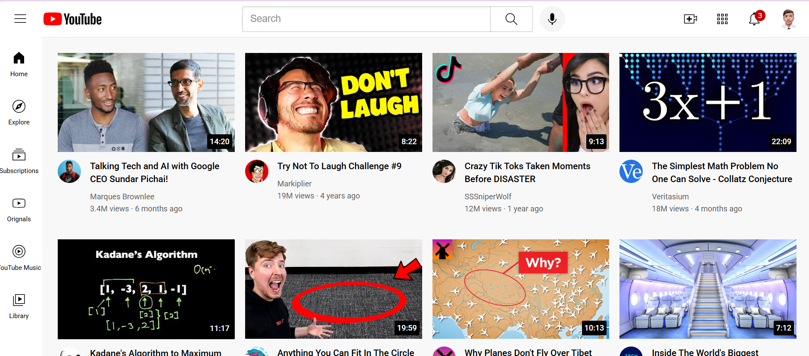
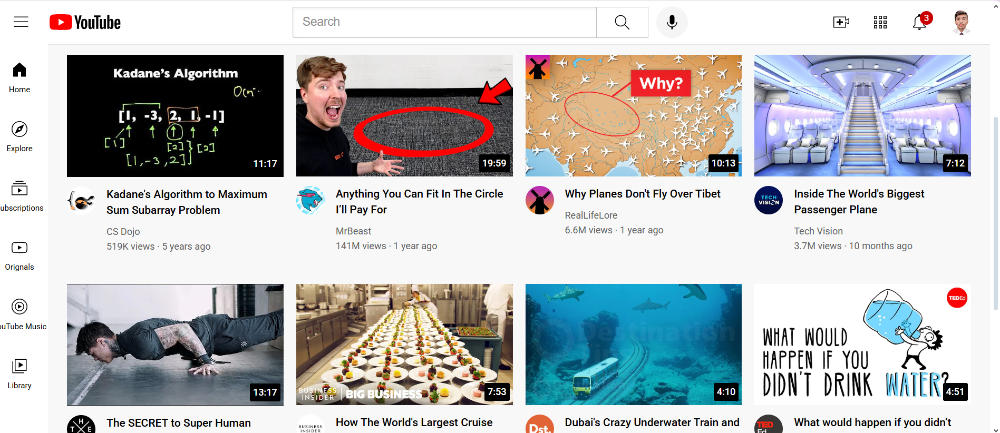
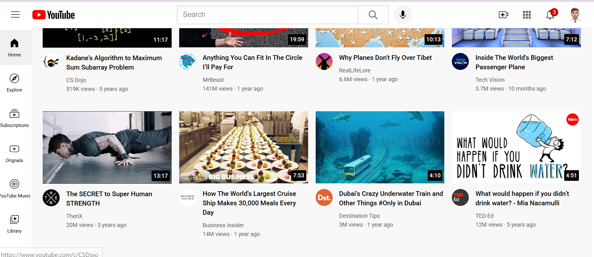

# YouTube

**Live Demo:** [View Project](https://maazcodecraft.github.io/YouTube-clone)

---

## Screenshots

### Home Page

---

---

## Project Demo Video

[📥 Download Demo Video](project-screenshots/project-video.mp4)

---

## Features

- Responsive YouTube-like interface
- Header with search functionality
- Sidebar navigation
- Video grid layout with thumbnails
- Channel information and video metadata
- Hover effects and tooltips

## Technologies Used

- HTML5
- CSS3 (Flexbox & Grid)
- Custom styling for header, sidebar, and video components
